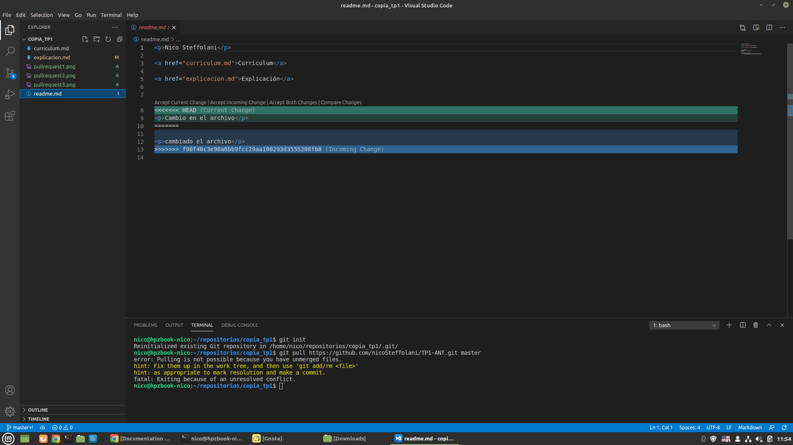

Imagenes explicativas sobre como hacer un pull request: 

Herramienta para hacer el merge en visual studio

Versiones LOCAL, BASE y REMOTE: LOCAL is my local branch, BASE is 
common ancestor and REMOTE is the branch to be merged.

